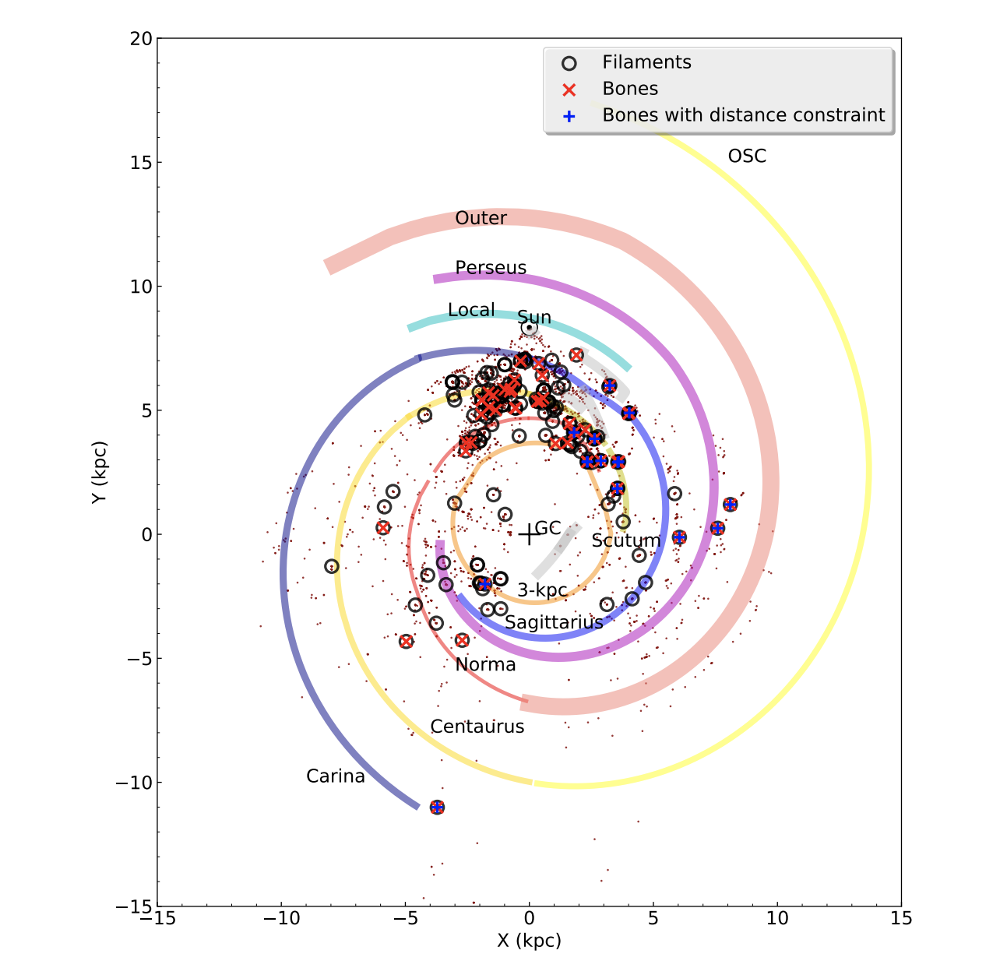
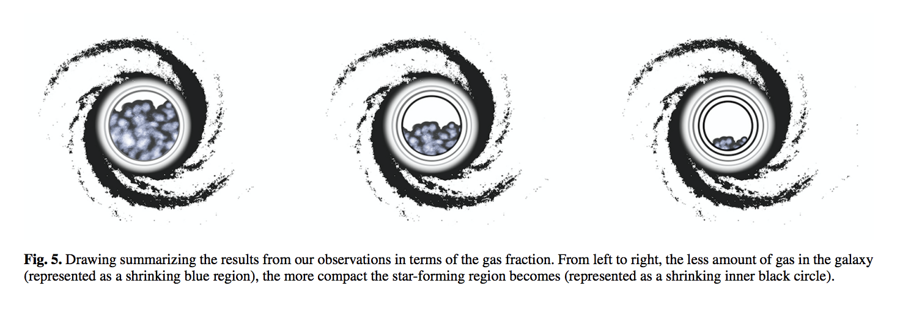
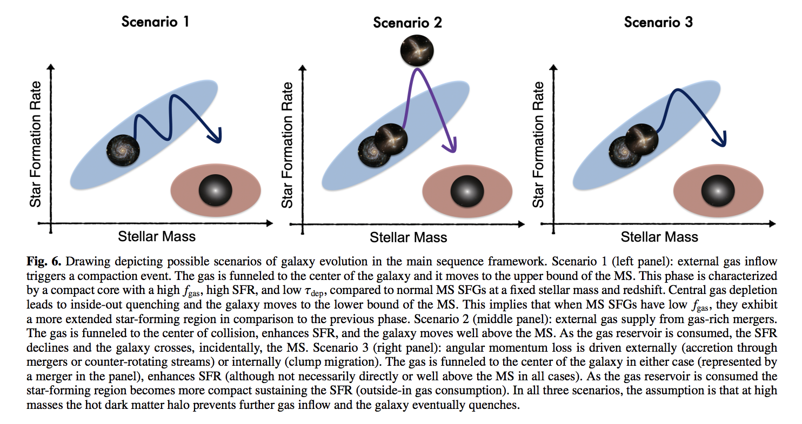
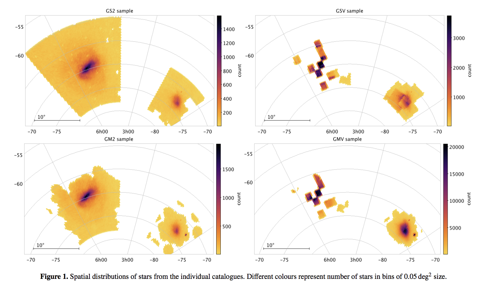
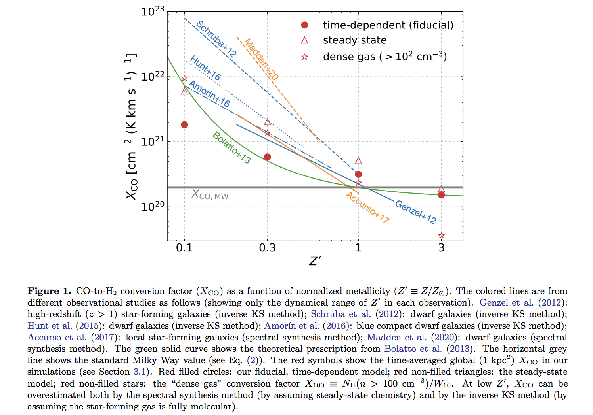
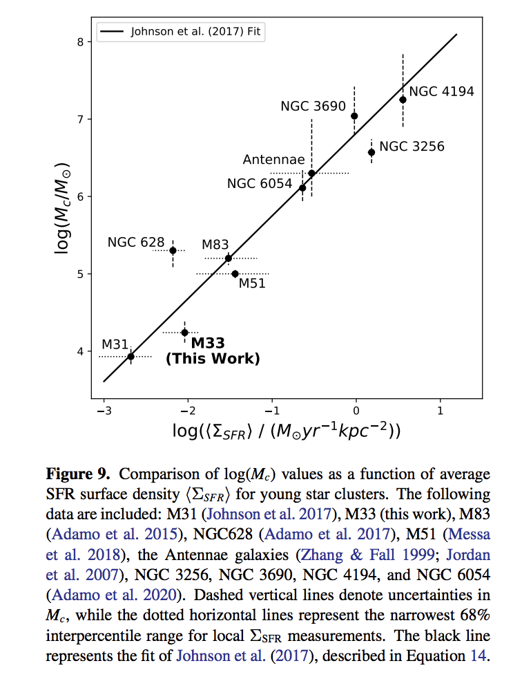
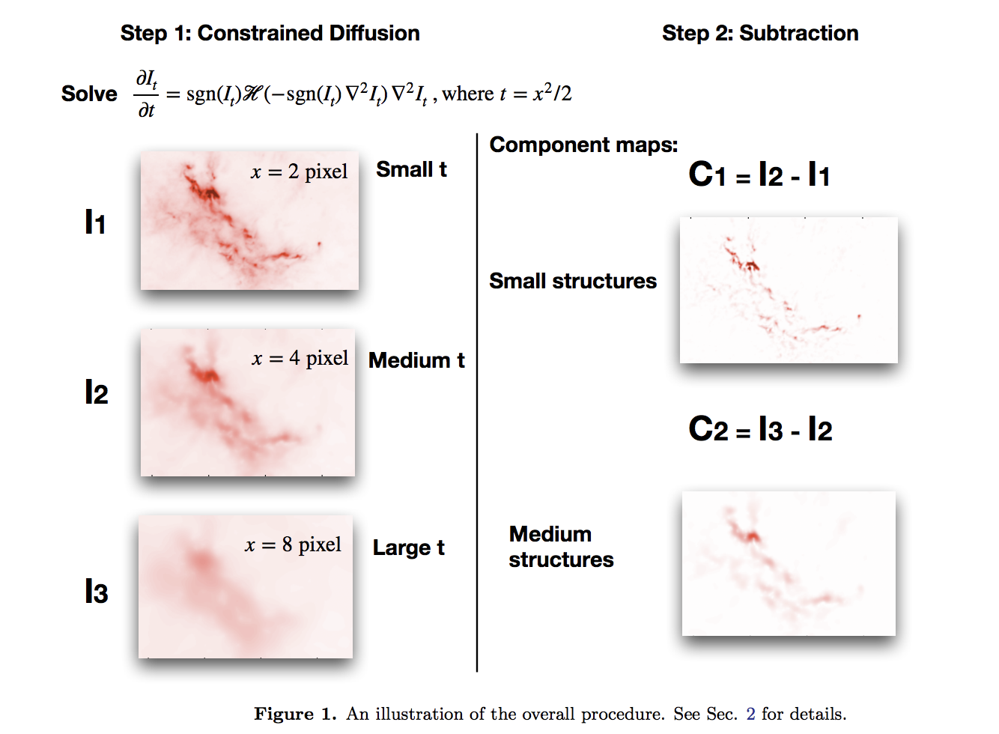

## 2022-01-06

1.[The Gas-Star Formation Cycle in Nearby Star-forming Galaxies II. Resolved Distributions of CO and Hα Emission for 49 PHANGS Galaxies](https://arxiv.org/abs/2201.01403)
> Extragalactic Galaxy, gas, star-formation

This work compared observations of CO line emission and narrowband H$\alpha$ maps of 49  nearby star-forming main sequence disk galaxies.
Results at 150 pc resolution suggest that the relationship between molecular gas and SFR tracers in the Kennicutt–Schmidt plane depends on host-galaxy properties.
Galaxies without these structures, galaxies with a stellar bar only, and galaxies with both a bar and granddesign spiral arms exhibit broadly similar sightline fractions.

2.[A census of 163 large-scale (>=10 pc), velocity-coherent filaments in inner Galactic plane: physical properties, dense gas fraction, and association with spiral arms](https://arxiv.org/abs/2201.01555)
>Galaxy structure, filaments

By using a customized minimum spanning tree algorithm to identify filaments by linking Galactic clumps from the APEX Telescope Large Area Survey of the Galaxy catalogue, They identify 163 large-scale filaments with physical properties derived, including dense gas mass fraction, and compare them with an updated spiral arm model in position-position-velocity space.
Dense gas:  take contour with a higher level in the extinction map as the boundary to calculate dense gas, and contour with lower level as boundary of total mass.
Dense gas mass fractions of filaments have no significant distinctions in different Galactic radii and vertical height above Galactic mid-plane, in contrast to previous studies.
Bone fraction and DGMF do not vary too much in different spiral arms.
Dense clumps in filaments have no obvious distinction in mass compared with those not in on the same scale.

## 2022-01-07
1.[Redshifted methanol absorption tracing infall motions of high-mass star formation regions](https://arxiv.org/abs/2201.01792)
>infall, star-formation, high mass star-formation

They test if redshifted CH3OH transitions absorption can be used to trace infall motions within high-mass star formation regions

## 2022-01-10
1.[Properties of Molecular Gas in Galaxies in Early and Mid Stages of Interaction. III. Resolved Kennicutt-Schmidt Law](https://arxiv.org/abs/2201.02270)

2.[Discovery of C5H+ and detection of C3H+ in TMC-1 with the QUIJOTE line survey](https://arxiv.org/abs/2201.02434)

3.[ALMA Survey of Orion Planck Galactic Cold Clumps (ALMASOP): A Hot Corino Survey toward Protostellar Cores in the Orion Cloud](https://arxiv.org/abs/2201.02497)

## 2022-01-11
1.[GOODS-ALMA 2.0: Starbursts in the main sequence reveal compact star formation regulating galaxy evolution prequenching](https://arxiv.org/abs/2201.02633)
>galaxies evolution, star formation

GOODS-ALMA 2.0 survey, an ALMA blind survey at 1.1 mm covering a continuous area of 72.42 arcmin2 using two array configurations.

2.[Selective Element Depletion in the Orion Nebula Self-consistent grain depletions and abundances I: The Orion Nebula as a test case](https://arxiv.org/abs/2201.02882)

3.[Dust distributions in the Magellanic Clouds](https://arxiv.org/abs/2201.03152)
>: dust, extinction, Magellanic Clouds

They present high-resolution maps of the dust reddening in the Magellanic Clouds (MCs), which have a spatial angular resolution between 26 arcsec and 55 arcmin, based on the data from the optical and near-infrared (IR) photometric surveys, including the Gaia Survey, the SkyMapper Southern
Survey (SMSS), the Survey of the Magellanic Stellar History (SMASH), the Two Micron All Sky Survey (2MASS) and the near-infrared Y JKS VISTA survey of the Magellanic Clouds system (VMC).

## 2022-01-12
1.[The ALMaQUEST Survey IX: The nature of the resolved star forming main sequence](https://arxiv.org/abs/2201.03592)
>fundamental parameters, star formation

ALMA-MaNGA QUEnching and STar formation (ALMaQUEST) survey.
The extinction-corrected H𝛼 flux is then used to determine the star formation rate.
The Partial Correlation Coefficient analysis shows that ΣSFR depends directly on just ΣH2 and has no intrinsic dependence on Σ∗.

2.[***Dependence of XCO on metallicity, intensity, and spatial scale in a self-regulated interstellar medium](https://arxiv.org/abs/2201.03885)
>X factor

They have studied the CO-to-H2 conversion factor and the line ratio of CO(2–1) to CO(1–0) in high-resolution (∼0.2 pc) hydrodynamical simulations of a multiphase ISM across a wide range of metallicity (0.1 ≤ Z ≤ 3) in HSvD21.

3.[The protoplanetary disk population in the rho-Ophiuchi region L1688 and the time evolution of Class II YSOs](https://arxiv.org/abs/2201.04079)
>YSOs, star formation

This paper provides a description of disk masses and mass accretion rates in the ρ-Oph region L1688, one of the richer and younger star-forming regions in the Solar neighbourhood.

## 2022-01-13
1.[The Panchromatic Hubble Andromeda Treasury: Triangulum Extended Region (PHATTER). III. The Mass Function of Young Star Clusters in M33](https://arxiv.org/abs/2201.04161 )
>star formation law, star cluster

The M33 CMF is not well described by a pure power law.
This data adds evidence that there is a clear correlation between the cluster truncation mass Mc and ΣSFR.

2.[Velocity structure of the 50 pc-long NGC 6334 filamentary cloud: Hints of multiple compressions and their impact on the cloud properties?](https://arxiv.org/abs/2201.04267)
>star formation, clouds

## 2022-01-14
1.[The Rate, Amplitude and Duration of Outbursts from Class 0 Protostars in Orion](https://arxiv.org/abs/2201.04647 )
>protostars, star formation

In total, They show that bursts from Class 0 protostars are as frequent, or even more frequent, than those from more evolved protostars.

2.[The 3D magnetic field morphology of the Perseus molecular cloud An arc-shaped morphology](https://arxiv.org/abs/2201.04718)
>magnetic fields

They use previous line-of-sight and plane-of-sky magnetic field observations, as well as Galactic magnetic field models, to
reconstruct the complete 3D magnetic field vectors and morphology associated with the Perseus cloud.

3.[B-fields in Star-Forming Region Observations (BISTRO): Magnetic Fields in the Filamentary Structures of Serpens Main](https://arxiv.org/abs/2201.05059)
>magnetic fields

## 2022-01-17
1.[Multi-Scale Decomposition of Astronomical Maps -- Constrained Diffusion Method](https://arxiv.org/abs/2201.05484)
>image analysis

They propose a new, efficient multi-scale method to decompose a map (or signal in general) into
components maps that contain structures of different sizes.

1.[3D extinction mapping of the Milky Way using Convolutional Neural Networks: Presentation of the method and demonstration in the Carina Arm region](https://arxiv.org/abs/2201.05571)
> dust, extinction, deep learning

They found deep learning to be a reliable approach to produce 3D extinction maps from large surveys.
With this methodology, They expect to easily combine heterogeneous surveys without cross-matching, and therefore to exploit several surveys in a
complementary fashion.

